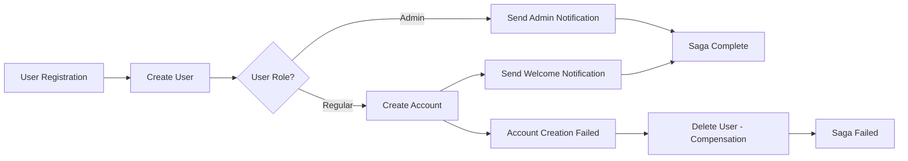
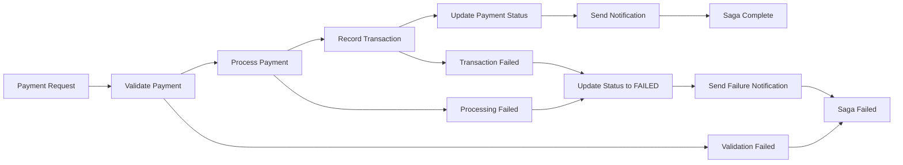

# Banking as a Service (BaaS) Platform

## Overview

A production-ready Banking as a Service platform built with Spring Boot microservices architecture, featuring modern saga orchestration patterns for distributed transaction management. The platform demonstrates enterprise-grade banking operations with event-driven communication and robust error handling.

## Key Features

- **Modern Saga Architecture**: Abstract saga pattern with type-safe lifecycle management and compensation logic
- **Complete Banking Operations**: User onboarding, account management, payment processing, and transaction recording
- **Event-Driven Communication**: Apache Kafka with Spring Cloud Stream for reliable asynchronous messaging
- **Security & Authentication**: OAuth 2.0/JWT integration with Keycloak, role-based access control (RBAC)
- **Admin Dashboard**: Unified REST endpoint providing consolidated view of all system data
- **Production-Ready Infrastructure**: MySQL database, Docker containerization, service discovery, and API gateway

## Architecture

### Technology Stack
- **Framework**: Spring Boot 3.x with Java 21
- **Build Tool**: Maven multi-module project with centralized dependency management
- **Database**: MySQL 8.0 with service-specific schemas and connection pooling
- **Authentication**: Keycloak OAuth 2.0, OpenID Connect, JWT token validation
- **Messaging**: Apache Kafka + Spring Cloud Stream for event-driven architecture
- **Orchestration**: Modern abstract saga pattern for distributed transaction coordination
- **Infrastructure**: Docker Compose, Eureka service discovery, Spring Cloud Gateway

### Microservices

1. **API Gateway** - Unified entry point with routing, authentication, and admin dashboard aggregation
2. **Service Discovery** - Eureka-based service registration and health monitoring
3. **User Service** - User registration, authentication, and management with saga integration
4. **Account Service** - Account lifecycle management, balance operations, payment processing
5. **Transaction Service** - Transaction recording and history tracking
6. **Payment Service** - Payment validation, processing, and status management
7. **Notification Service** - Event-driven email notifications for banking operations
8. **Saga Orchestrator Service** - Modern saga pattern implementation with state management and compensation
9. **Common Library** - Shared entities, events, commands, and utilities

## Saga Flows

### 1. User Onboarding Saga



**Flow Steps:**
1. **Create User** → user-service creates user account
2. **Open Account** → account-service creates bank account (skipped for admin users)
3. **Send Notification** → notification-service sends welcome email
4. **Compensation** → Delete user if account creation fails

### 2. Payment Processing Saga



**Flow Steps:**
1. **Validate Payment** → account-service validates source account and balance
2. **Process Payment** → payment-service processes the transaction
3. **Record Transaction** → transaction-service records debit/credit entries
4. **Update Status** → payment-service marks payment as completed
5. **Send Notification** → notification-service sends confirmation email
6. **Compensation** → Handle failures with appropriate notifications and status updates

## API Endpoints

### Saga Management
- `POST /api/saga/start/user-onboarding` - Start user onboarding saga
- `POST /api/saga/start/payment-processing` - Start payment processing saga
- `GET /api/saga/instances` - View all saga instances with step details (Admin only)

### Core Operations
- `POST /api/users/register` - User registration
- `GET /api/admin/dashboard` - System-wide data aggregation (Admin only)

### Authentication
- **BAAS_ADMIN**: Full system access, can view all data and saga instances
- **ACCOUNT_HOLDER**: Standard user operations, personal data access only

## Quick Start

### Prerequisites
- Java 21
- Docker & Docker Compose
- Maven 3.8+

### Running the Platform

1. **Start Infrastructure**:
   ```bash
   ./start-infra.sh
   ```

2. **Build and Start Services**:
   ```bash
   ./start-all-services.sh
   ```

3. **Access Points**:
   - **API Gateway**: http://localhost:8080
   - **Keycloak Admin**: http://localhost:8180/admin (admin/admin)
   - **Service Discovery**: http://localhost:8761

## Frontend Application

A complete React-based web application is available to interact with this Banking as a Service platform:

**Repository**: [BaaS Bank UI](https://github.com/rajeswarandhandapani/baas-bank-ui)

The frontend provides:
- User registration and authentication
- Account management dashboard
- Payment processing interface
- Transaction history viewing
- Admin panel for system monitoring
- Saga instance tracking and monitoring

## Modern Saga Pattern

The platform implements an abstract saga framework that enables:

- **Type-Safe Lifecycle**: Abstract base class with `startSaga()`, `completeSaga()`, `failSaga()` methods
- **Event-Driven Coordination**: Services communicate via Kafka events while maintaining clear orchestration
- **State Management**: Persistent saga instances and step tracking with MySQL storage
- **Compensation Logic**: Automatic rollback mechanisms with comprehensive error handling
- **Step Monitoring**: Real-time visibility into saga execution with detailed step instances

### Saga Lifecycle

1. **Initialization**: `startSaga(payload)` → Creates SagaInstance
2. **Execution**: Event-driven step progression with state persistence
3. **Completion**: `completeSaga()` or automatic failure handling with compensation
4. **Monitoring**: Real-time saga and step instance tracking via REST API
